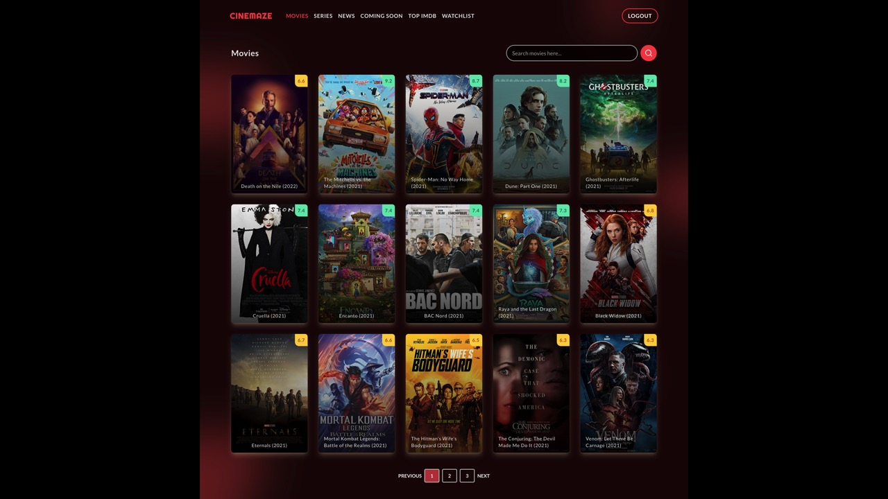

# Laravel Breeze - nuxt.js Edition 🏝️

## Introduction

This repository is an implementing of the [Laravel Breeze](https://laravel.com/docs/starter-kits) application / authentication starter kit frontend in [nuxt.js](https://nuxtjs.org). All of the authentication boilerplate is already written for you - powered by [Laravel Sanctum](https://laravel.com/docs/sanctum), allowing you to quickly begin pairing your beautiful nuxt.js frontend with a powerful Laravel backend.





## Official Documentation

### Installation

run command

```
npm i && npm run dev
```

> Note: Currently, we recommend using `localhost` during local development of your backend and frontend to avoid CORS "Same-Origin" issues.
